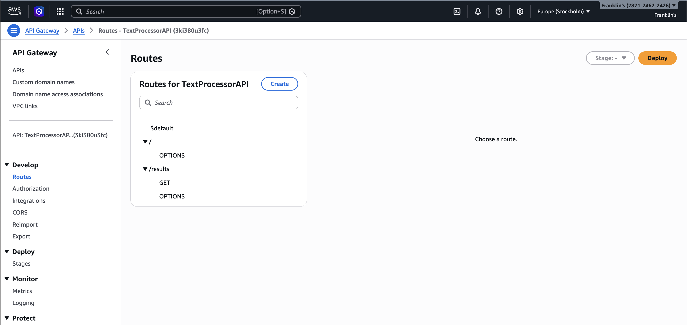
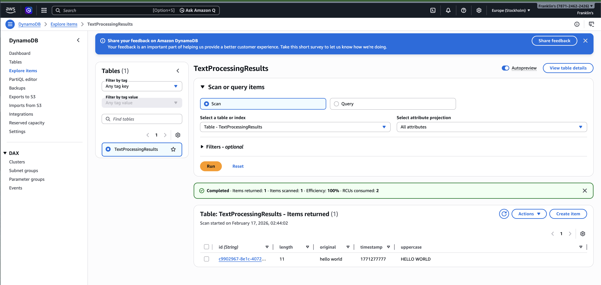
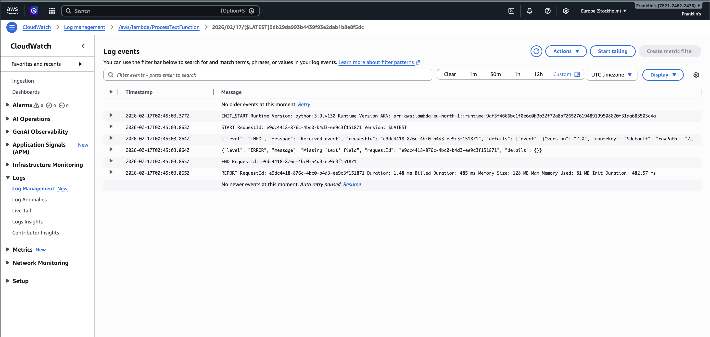
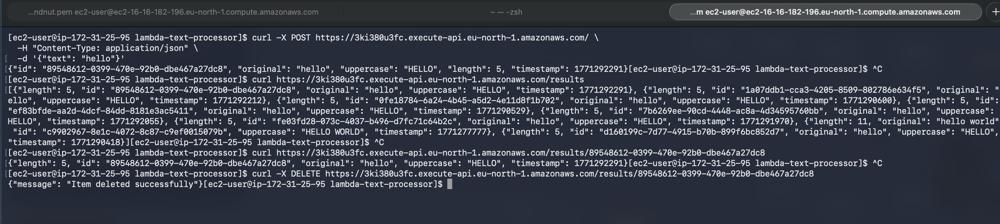

# 🚀 Text Processing Serverless API


A fully serverless CRUD API built using **AWS Lambda**, **API Gateway**, and **DynamoDB**.  
Designed with clean architecture, structured logging, and production‑grade error handling.

---

## 📑 Table of Contents

- [📸 Screenshots](#-screenshots)
- [🏗 Architecture Overview](#-architecture-overview)
  - [High‑Level Architecture Diagram](#highlevel-architecture-diagram)
  - [Sequence Diagram (POST → DynamoDB)](#sequence-diagram-post--dynamodb)
- [🌐 Base URL](#-base-url)
- [📚 API Documentation](#-api-documentation)
  - [POST `/`](#-post-)
  - [GET `/results`](#-get-results)
  - [GET `/results/{id}`](#-get-resultsid)
  - [DELETE `/results/{id}`](#-delete-resultsid)
  - [CORS](#-cors)
  - [DynamoDB Schema](#-dynamodb-schema)
  - [Logging Strategy](#-logging-strategy)
  - [Local Testing](#-local-testing)
- [🚧 Future Improvements](#-future-improvements)
- [🎉 Final Notes](#-final-notes)


# 📸 Screenshots

### 01 — API Gateway Routes


### 02 — DynamoDB Table


### 03 — CloudWatch Logs


### 04 — cURL Tests (POST → GET All → GET One → DELETE)


---

# 🏗 Architecture Overview

## High‑Level Architecture Diagram

```
                ┌──────────────────────────┐
                │      API Gateway         │
                │  (REST Endpoints Layer)  │
                └─────────────┬────────────┘
                              │
     ┌────────────────────────┼────────────────────────┐
     │                        │                        │
┌──────────┐           ┌──────────────┐         ┌──────────────┐
│ POST /   │           │ GET /results │         │ GET /results/ │
│process   │           │   (list)     │         │     {id}      │
└────┬─────┘           └──────┬───────┘         └──────┬───────┘
     │                        │                        │
     ▼                        ▼                        ▼
┌──────────┐           ┌──────────────┐         ┌──────────────┐
│ Lambda   │           │ Lambda       │         │ Lambda       │
│Process   │           │ListResults   │         │GetResult     │
└────┬─────┘           └──────┬───────┘         └──────┬───────┘
     │                        │                        │
     └──────────────┬─────────┴──────────┬────────────┘
                    ▼                    ▼
                ┌──────────────────────────────┐
                │     DynamoDB Table           │
                │  TextProcessingResults       │
                └──────────────────────────────┘
```


## Sequence Diagram (POST → DynamoDB)

```
Client
  │
  │ POST /
  ▼
API Gateway
  │
  │ invokes Lambda
  ▼
ProcessTextFunction
  │
  │ put_item()
  ▼
DynamoDB
  │
  │ success
  ▼
ProcessTextFunction
  │
  │ returns JSON
  ▼
Client
```

# 🌐 Base URL
https://3ki380u3fc.execute-api.eu-north-1.amazonaws.com
---


# 📚 API Documentation

## 🔵 POST `/`

Process text and store the result.

### Request Body

```json
{
  "text": "hello world"
}
```

### Example Response

```json
{
  "id": "uuid",
  "original": "hello world",
  "uppercase": "HELLO WORLD",
  "length": 11,
  "timestamp": 1771283745
}
```

### Example cURL

```bash
curl -X POST https://3ki380u3fc.execute-api.eu-north-1.amazonaws.com/ \
  -H "Content-Type: application/json" \
  -d '{"text": "hello world"}'
```

---

## 🟢 GET `/results`

List all stored results.

### Example Response

```json
[
  {
    "id": "uuid",
    "original": "hello",
    "uppercase": "HELLO",
    "length": 5,
    "timestamp": 1771283745
  }
]
```

### Example cURL

```bash
curl https://3ki380u3fc.execute-api.eu-north-1.amazonaws.com/results
```

---

## 🟡 GET `/results/{id}`

Retrieve a single result by ID.

### Example Request

```
GET /results/f5e565d8-bc1f-4911-a810-e1c3e06d8c98
```

### Example Response

```json
{
  "id": "f5e565d8-bc1f-4911-a810-e1c3e06d8c98",
  "original": "hello",
  "uppercase": "HELLO",
  "length": 5,
  "timestamp": 1771283745
}
```

### Example cURL

```bash
curl https://3ki380u3fc.execute-api.eu-north-1.amazonaws.com/results/<id>
```

---

## 🔴 DELETE `/results/{id}`

Delete a result by ID.

### Example Request

```
DELETE /results/f5e565d8-bc1f-4911-a810-e1c3e06d8c98
```

### Example Response

```json
{ "message": "Item deleted successfully" }
```

### Example cURL

```bash
curl -X DELETE https://3ki380u3fc.execute-api.eu-north-1.amazonaws.com/results/<id>
```

---

## 🛡 CORS

All responses include:

```json
{
  "Access-Control-Allow-Origin": "*",
  "Access-Control-Allow-Methods": "GET,POST,DELETE,OPTIONS",
  "Access-Control-Allow-Headers": "Content-Type"
}
```

---

## 🗄 DynamoDB Schema

```
Table: TextProcessingResults

Attribute   | Type
------------|--------
id          | String (PK)
original    | String
uppercase   | String
length      | Number
timestamp   | Number
```

---


## 📊 Logging Strategy

Every Lambda uses structured JSON logs:

```json
{
  "level": "INFO",
  "message": "Item stored successfully",
  "requestId": "abc-123",
  "details": { "id": "uuid" }
}
```

This makes CloudWatch logs:

- searchable  
- filterable  
- machine‑readable  
- consistent across all Lambdas  

---

## 🧪 Local Testing

### POST

```bash
curl -X POST https://3ki380u3fc.execute-api.eu-north-1.amazonaws.com/ \
  -H "Content-Type: application/json" \
  -d '{"text": "hello"}'
```

### GET all

```bash
curl https://3ki380u3fc.execute-api.eu-north-1.amazonaws.com/results
```

### GET one

```bash
curl https://3ki380u3fc.execute-api.eu-north-1.amazonaws.com/results/<id>
```

### DELETE

```bash
curl -X DELETE https://3ki380u3fc.execute-api.eu-north-1.amazonaws.com/results/<id>
```

## 🚧 Future Improvements

Planned enhancements for the next iteration:

- Add authentication (Cognito or JWT-based access control)
- Add pagination support to `/results`
- Add an update endpoint (PATCH)
- Build a frontend UI (React or Svelte)
- Add full infrastructure-as-code deployment (CloudFormation or CDK)

---

## 🎉 Final Notes

This project demonstrates:

- Clean serverless architecture
- Modular Lambda design
- Consistent structured logging
- DynamoDB best practices
- Production‑grade error handling

A solid showcase of DevOps and backend engineering skills.
